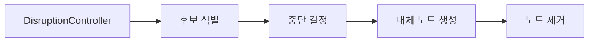
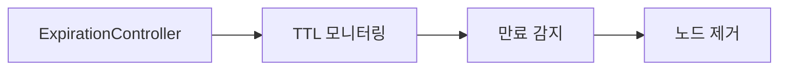

# Karpenter 컨트롤러 워크플로우

이 문서는 Karpenter의 주요 컨트롤러와 그들의 워크플로우를 설명합니다.

## 개요

Karpenter는 여러 컨트롤러로 구성되어 있으며, 각 컨트롤러는 특정 기능을 담당합니다. 주요 컨트롤러는 다음과 같습니다:

1. **프로비저닝 컨트롤러**: 노드 생성 관리
2. **중단 컨트롤러**: 노드 제거 관리
3. **노드 상태 컨트롤러**: 노드 상태 모니터링
4. **만료 컨트롤러**: TTL 기반 노드 제거 관리

## 프로비저닝 워크플로우

프로비저닝 컨트롤러는 다음과 같은 워크플로우로 작동합니다:

1. **파드 감지**: `PodController`가 스케줄링 불가능한 파드를 감지합니다.
2. **파드 배치**: `Provisioner`가 파드를 배치하고 스케줄링 결정을 내립니다.
3. **노드 생성**: 적절한 노드 유형을 결정하고 `NodeClaim`을 생성합니다.
4. **파드 바인딩**: 생성된 노드에 파드를 바인딩합니다.


### 주요 구성 요소

- **Provisioner**: 프로비저닝 로직의 핵심 구현체
- **Scheduler**: 파드를 노드에 스케줄링하는 로직 구현
- **NodeClaim**: 프로비저닝된 노드를 나타내는 리소스

## 중단 워크플로우

중단 컨트롤러는 다음과 같은 워크플로우로 작동합니다:

1. **후보 식별**: 중단 가능한 노드를 식별합니다.
2. **중단 결정**: 중단 방법(빈 노드 제거, 드리프트 감지, 노드 통합 등)을 결정합니다.
3. **대체 노드 생성**: 필요한 경우 대체 노드를 생성합니다.
4. **노드 제거**: 기존 노드를 제거합니다.



### 중단 방법

Karpenter는 다음과 같은 중단 방법을 제공합니다:

#### 1. Emptiness (빈 노드 제거)

빈 노드 제거는 실행 중인 파드가 없는 노드를 감지하고 제거하는 방법입니다.

- **목적**: 리소스 낭비 방지
- **작동 방식**:
  1. 실행 중인 파드가 없는 노드 식별
  2. 노드 제거 결정
  3. 노드 제거 실행
- **장점**: 중단 비용이 없음 (파드 이동 없음)

#### 2. Drift (드리프트 감지)

드리프트 감지는 노드가 원래 프로비저닝된 사양에서 벗어났을 때 해당 노드를 감지하고 제거하는 방법입니다.

- **목적**: 일관된 노드 구성 유지
- **작동 방식**:
  1. 드리프트된 노드 식별
  2. 파드 재스케줄링 가능성 확인
  3. 필요한 경우 대체 노드 생성
  4. 드리프트된 노드 제거
- **드리프트 원인**:
  - 노드풀 요구사항 변경
  - 노드 레이블 변경
  - 클라우드 프로바이더 구성 변경

#### 3. SingleNodeConsolidation (단일 노드 통합)

단일 노드 통합은 하나의 저활용 노드를 더 효율적인 노드로 대체하는 방법입니다.

- **목적**: 비용 최적화
- **작동 방식**:
  1. 저활용 노드 식별
  2. 더 비용 효율적인 대안 평가
  3. 대체 노드 생성
  4. 파드 마이그레이션
  5. 기존 노드 제거
- **최적화 기준**:
  - 인스턴스 유형 비용
  - 용량 유형 (스팟 vs 온디맨드)
  - 리소스 사용률

#### 4. MultiNodeConsolidation (다중 노드 통합)

다중 노드 통합은 여러 개의 저활용 노드를 하나의 더 효율적인 노드로 통합하는 방법입니다.

- **목적**: 비용 최적화 및 클러스터 밀도 향상
- **작동 방식**:
  1. 여러 저활용 노드 식별
  2. 통합 가능성 평가
  3. 대체 노드 생성
  4. 파드 마이그레이션
  5. 기존 노드 제거
- **알고리즘**:
  - 이진 검색을 사용하여 최적의 통합 조합 찾기
  - 중단 비용 최소화를 위한 노드 정렬
  - 통합 후 비용 절감 확인

### 중단 제어 메커니즘

Karpenter는 중단을 제어하기 위한 여러 메커니즘을 제공합니다:

1. **중단 예산**: NodePool별로 동시에 중단할 수 있는 노드 수 제한
2. **통합 정책**: 빈 노드만 통합할지 또는 저활용 노드도 통합할지 결정
3. **통합 지연**: 노드가 생성된 후 통합을 시작하기 전 대기 시간
4. **검증**: 중단 전 파드 재스케줄링 가능성 확인

### 중단 오케스트레이션

중단 컨트롤러는 `orchestration.Queue`를 사용하여 중단 작업을 관리합니다:

1. **명령 생성**: 중단 방법이 중단 명령 생성
2. **큐 추가**: 명령이 오케스트레이션 큐에 추가됨
3. **실행**: 큐가 명령을 실행하고 노드 제거 관리
4. **모니터링**: 파드 마이그레이션 및 노드 종료 모니터링

## 노드 상태 워크플로우

노드 상태 컨트롤러는 다음과 같은 워크플로우로 작동합니다:

1. **상태 모니터링**: 노드의 상태를 지속적으로 모니터링합니다.
2. **비정상 감지**: 비정상 상태의 노드를 감지합니다.
3. **복구 결정**: 노드를 복구할지 또는 제거할지 결정합니다.
4. **조치 실행**: 결정에 따라 조치를 실행합니다.


## 만료 워크플로우

만료 컨트롤러는 다음과 같은 워크플로우로 작동합니다:

1. **TTL 모니터링**: 노드의 TTL(Time To Live)을 모니터링합니다.
2. **만료 감지**: TTL이 초과된 노드를 감지합니다.
3. **노드 제거**: 만료된 노드를 제거합니다.



## 컨트롤러 간 상호 작용

Karpenter의 컨트롤러들은 다음과 같이 상호 작용합니다:

1. **프로비저닝 -> 중단**: 프로비저닝 컨트롤러가 생성한 노드는 중단 컨트롤러에 의해 관리됩니다.
2. **중단 -> 프로비저닝**: 중단 컨트롤러가 노드를 제거할 때 프로비저닝 컨트롤러에게 대체 노드 생성을 요청할 수 있습니다.
3. **상태 -> 중단**: 상태 컨트롤러가 비정상 노드를 감지하면 중단 컨트롤러에게 노드 제거를 요청할 수 있습니다.
4. **만료 -> 중단**: 만료 컨트롤러가 만료된 노드를 감지하면 중단 컨트롤러에게 노드 제거를 요청할 수 있습니다.

## 전체 워크플로우 다이어그램

```
                                +-------------------+
                                |   Kubernetes     |
                                |   API Server     |
                                +--------+---------+
                                         |
                                         v
+----------------+            +----------+----------+
|                |            |                     |
|  NodePool CRD  +----------->+  Karpenter Core     |
|                |            |                     |
+----------------+            +---------+-----------+
                                        |
                                        |
                 +--------------------+-+-------------------+
                 |                    |                     |
                 v                    v                     v
        +--------+-------+   +--------+-------+    +--------+-------+
        |                |   |                |    |                |
        | Provisioning   |   | Disruption     |    | Node State     |
        | Controller     |   | Controller     |    | Controller     |
        |                |   |                |    |                |
        +--------+-------+   +--------+-------+    +--------+-------+
                 |                    |                     |
                 |                    |                     |
                 v                    v                     v
        +--------+-------+   +--------+-------+    +--------+-------+
        |                |   |                |    |                |
        | Cloud Provider |   | Orchestration  |    | Metrics       |
        | Interface      |   | Queue          |    | Collection    |
        |                |   |                |    |                |
        +----------------+   +----------------+    +----------------+
```

## 결론

Karpenter의 컨트롤러들은 서로 긴밀하게 협력하여 클러스터의 효율성과 비용을 최적화합니다. 특히 중단 컨트롤러는 다양한 방법(빈 노드 제거, 드리프트 감지, 단일 노드 통합, 다중 노드 통합)을 통해 클러스터 리소스를 효율적으로 관리합니다. 각 컨트롤러는 특정 기능을 담당하며, 이들의 상호 작용을 통해 Karpenter는 동적이고 효율적인 노드 관리를 제공합니다.